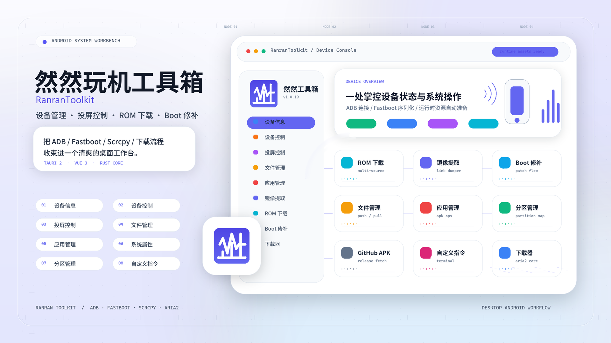
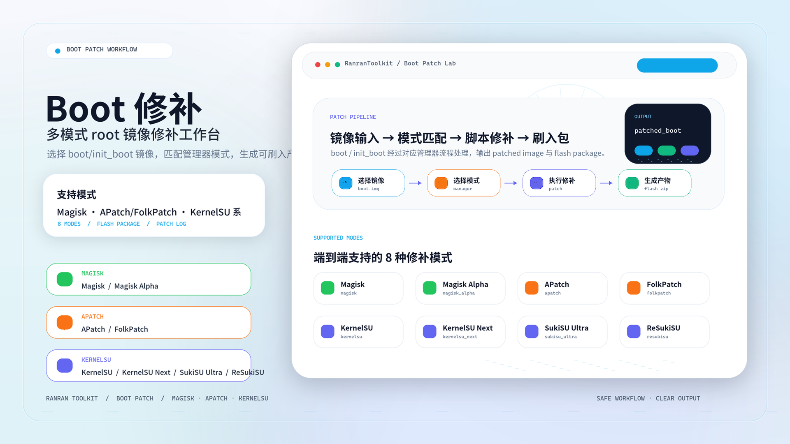
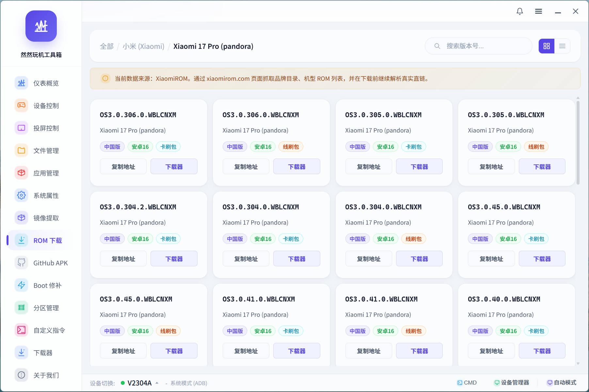
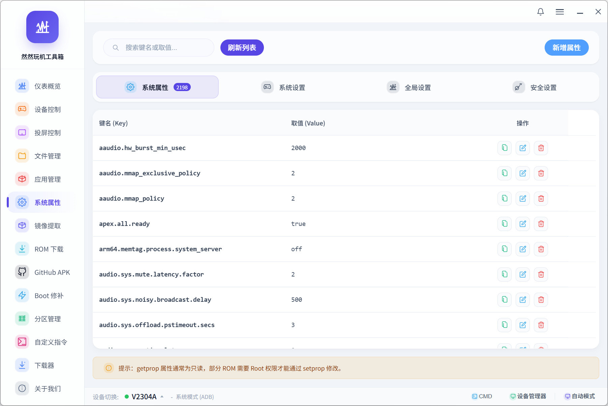
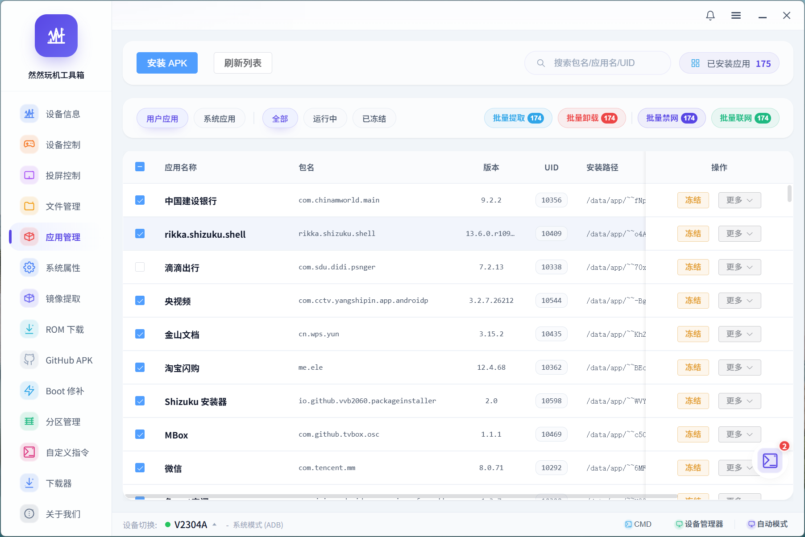
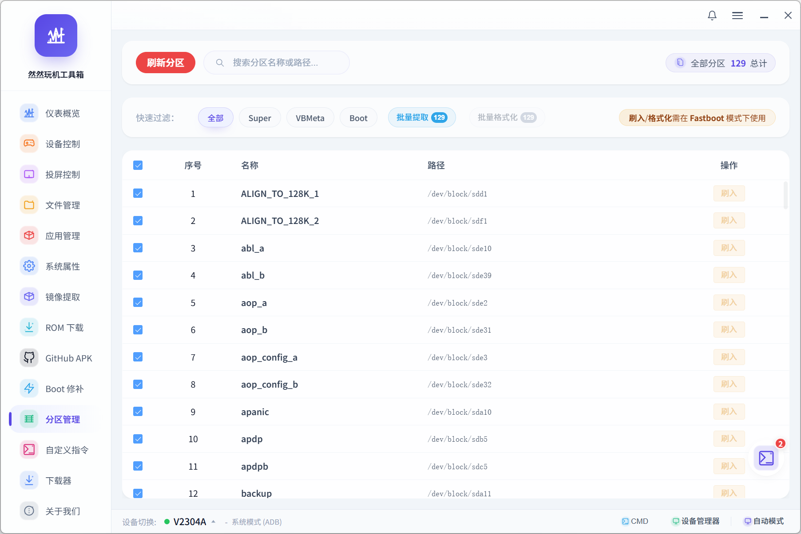
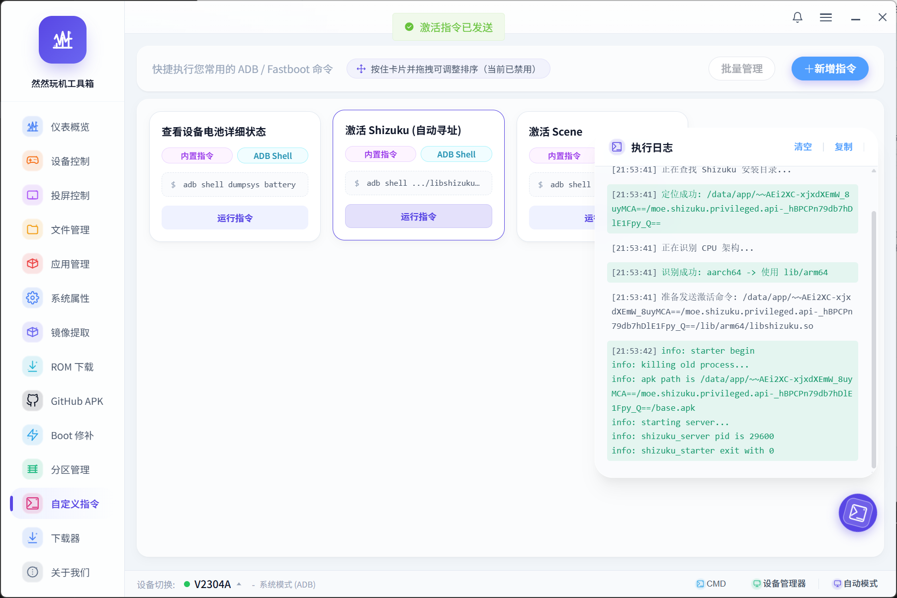

> **⚠️ 声明：本仓库仅为个人学习和 CI/CD 测试使用。源码同步自 Gitee 原仓库 [RanranToolkit](https://gitee.com/xiaowan12/toolkit-tauri-app)，版权和解释权归原作者所有，并非本人原创。**

<div align="center">

# 🔧 RanranToolkit (然然玩机工具箱)

> 基于 **Tauri 2 + Vue 3** 构建的现代化 Android 设备管理工具。轻量、美观、极速。

[](#)
[](#)
[](#)
[](#)

</div>

---

- **下载发行版**: 请查看 [releases](releases) 目录
- **项目定位**: 专为极客、开发者及刷机爱好者打造的“高颜值”一体化 Android 设备控制中心。
- **官方群 (QQ)**: `731971089`
- **仓库地址**: [Gitee · RanranToolkit](https://gitee.com/xiaowan12/toolkit-tauri-app)

## 🖼️ 宣传海报 (Posters)

<div align="center">
  <table>
    <tr>
      <td width="50%"><br /><sub>功能海报</sub></td>
      <td width="50%"><br /><sub>Boot 修补海报</sub></td>
    </tr>
  </table>
</div>

---

## 🖼️ 界面预览 (Screenshots)

<div align="center">
  <table>
    <tr>
      <td width="33.3%"><br /><sub>仪表盘</sub></td>
      <td width="33.3%"><br /><sub>无线调试</sub></td>
      <td width="33.3%"><br /><sub>设备控制</sub></td>
    </tr>
    <tr>
      <td width="33.3%"><br /><sub>投屏控制</sub></td>
      <td width="33.3%"><br /><sub>ROM下载</sub></td>
      <td width="33.3%"><br /><sub>系统属性</sub></td>
    </tr>
    <tr>
      <td width="33.3%"><br /><sub>镜像提取</sub></td>
      <td width="33.3%"><br /><sub>Boot修补</sub></td>
      <td width="33.3%"><br /><sub>文件管理</sub></td>
    </tr>
    <tr>
      <td width="33.3%"><br /><sub>应用管理</sub></td>
      <td width="33.3%"><br /><sub>分区管理</sub></td>
      <td width="33.3%"><br /><sub>自定义指令</sub></td>
    </tr>
    <tr>
      <td width="33.3%"><br /><sub>下载器</sub></td>
      <td width="33.3%"><br /><sub>github apk</sub></td>
      <td width="33.3%"><br /><sub>检查更新</sub></td>
    </tr>
  </table>
</div>

---

## 标准发版流程清单 (Release Checklist)

当前版本的发布方式已经调整为：

- 安装包/便携启动包不再内置 `bin/`
- 首次启动时，程序会自动检查本地运行时依赖
- 如果缺失，会根据 `ranran-toolkit-bin/cloud-parts/runtime-manifest.json` 下载并安装分卷资源

### 一、发版前准备

1. 确认本地 `bin/` submodule 已初始化且目录内容完整可用
   首次拉取仓库后如未自动初始化，请执行 `git submodule update --init --recursive`
2. 确认应用版本号已经更新
   文件：`package.json`
3. 如有在线更新机制，确认 `update.json` 内容已同步

### 二、标准打包命令

说明：

- `yarn build:tauri` 与 `yarn build:all` 已内置 `cargo clean --manifest-path src-tauri/Cargo.toml`
- 如果你想单独手动清理，也可以先执行 `yarn clean:tauri`

```bash
# 1. 安装依赖
yarn install

# 2. 清理 Tauri/Rust 构建缓存
yarn clean:tauri

# 3. 生成前端构建产物 + Tauri 安装包/便携启动包 + 运行时分卷
yarn build:all
```

如果只想单独执行某一步，可使用：

```bash
# 仅清理 Tauri/Rust 构建缓存
yarn clean:tauri

# 仅构建 Tauri 安装包
yarn build:tauri

# 仅生成内置运行时依赖便携包
yarn build:portable

# 仅生成运行时依赖分卷与 manifest（旧分发方案）
yarn build:runtime-assets
```

### 三、构建产物说明

#### 1. 安装包 / 桌面发布产物

通常位于：

- `src-tauri/target/release/bundle/`

这里会包含：

- `msi`
- `nsis`
- 以及其他 Tauri 目标产物

#### 2. 内置运行时依赖便携包

位于：

- `src-tauri/target/release/bundle/portable/`

当前便携包会包含主程序与 `bin/`，并自动排除 `bin/cloud-parts/`。

#### 3. 可选：运行时依赖分卷（旧分发方式）

位于：

- `bin/cloud-parts/`（由 `ranran-toolkit-bin` submodule 提供）

这里会生成：

- `runtime-manifest.json`
- `bin-runtime.zip.001`
- `bin-runtime.zip.002`
- 后续连续分卷若干

### 四、发布时必须上传的文件

当前默认发版只需要同步发布一类内容：

1. 应用安装包 / 便携启动包
   来源：`src-tauri/target/release/bundle/`

如果仍需维护旧的外部分卷分发方案，可额外发布 `bin/cloud-parts/` 下的 `runtime-manifest.json` 与全部 `bin-runtime.zip.*`。

### 五、推荐发布顺序

1. 更新 `package.json` 版本号
2. 执行 `yarn clean:tauri`
3. 执行 `yarn build:all`
4. 检查 `src-tauri/target/release/bundle/` 下安装包与便携包是否生成成功
5. 上传安装包 / 便携包
6. 如有在线更新机制，再同步更新 `update.json`
7. 用一台没有本地运行时缓存的机器做一次首启验证

### 六、发布后验证清单

建议至少验证以下项目：

1. 新安装的应用可以正常启动
2. 首次启动时无需联网下载运行时依赖
3. `ADB / Fastboot / Scrcpy / Aria2 / link-dumper` 可正常调用
4. 便携包解压后可以直接使用

### 七、常见注意事项

- 新版本默认依赖安装包 / 便携包内置的 `bin/`
- 旧的 `bin.7z.xxx` 不能直接继续给当前这套首启流程使用
- 如果 `bin/` 有任何内容变更，都应该重新执行 `yarn build:tauri` 与 `yarn build:portable`
- `yarn build:runtime-assets` 仅在维护旧的外部分卷分发方案时才需要执行
- 如果是全新克隆主仓库，请使用 `git clone --recurse-submodules`，或在克隆后执行 `git submodule update --init --recursive`
- 如果只改了前端或 Rust 代码、没有改 `bin/`，理论上可以只重新构建应用安装包，但正式发布时仍建议完整跑一次 `yarn build:all`

## 🚀 核心亮点 (Highlights)

- **极致轻量**: 基于 Tauri 2，剥离重型内核，安装包仅 10MB+，内存占用极低。
- **现代化 UI**: 采用毛玻璃拟态 (Glassmorphism) 设计，丝滑过渡动画，提供极致审美体验。
- **开箱即用**: 内置 ADB、Fastboot、Aria2c、Scrcpy 等核心工具，无需配置 Java、Python 或环境变量。
- **智能感知**: 具备设备心跳连接与模式自愈技术，自动适配系统、Recovery 及 Fastboot 模式。

## ✨ 核心功能 (Features)

- **📊 实时看板**: 监控 CPU、内存、存储及电池状态，深度扫描设备硬件与内核详情。
- **🔌 调试中心**: 支持 USB 与无线 ADB 连接。
- **🗑️ 应用超管**: 系统/用户应用分类检索，支持一键冻结、彻底禁网、APK 逆向提取。
- **🖥️ 投屏控制**: 基于 Scrcpy 提供毫秒级低延迟投屏，支持熄屏操作、高码率 DIY 渲染。
- **📥 下载枢纽**: Aria2 驱动的多线程下载，完美闭环机型 ROM 检索与下载。
- **💾 高阶工具**: 支持全区物理扫描、镜像一键提取、Payload 解码及 Boot 提取。
- **🔧 自定义指令**: 开放宏指令挂载，支持一键精简、自动化脚本执行。

## ⚙️ 技术架构 (Technical Stack)

- **Frontend**: Vue 3 (Composition API) + Pinia + Element Plus (Deep Custom)
- **Backend**: Tauri 2 (Rust Core) | IPC & RPC (Aria2c) 驱动
- **Logic**: 多态协议流管理，高等级并发调度管道。

## 📂 项目结构 (Structure)

```text
RanranToolkit/
├── bin/            # 核心二进制工具 (ADB, Fastboot, Aria2c)
├── tools/          # C++ 图形引擎辅助 (Scrcpy)
├── src-tauri/      # 客服端核心 (Rust) - 系统级权限与执行
└── src/            # 前端全景逻辑 (Vue 3)
    ├── api/        # 协议通讯层
    ├── views/      # 业务逻辑视图
    └── utils/      # 核心轮询与状态机
```

## 🚀 快速启动 (Getting Started)

```bash
# 1. 安装依赖
yarn install

# 2. 启动开发模式
yarn tauri dev

# 3. 开发环境手动生成 codename-model-map.json
yarn dev:generate-codename-model-map

# 4. 清理 Tauri/Rust 构建缓存
yarn clean:tauri

# 5. 编译发布版本 (MSI/EXE)
yarn build:all
```

## 开发工具命令

### 生成 `codename-model-map.json`

该功能已改为**开发专用命令**，不会再作为独立 `exe` 被打进安装包。

执行命令：

```bash
yarn dev:generate-codename-model-map
```

生成结果：

- 输出文件：`bin/rom-data/codename-model-map.json`
- 数据来源：`xiaomirom`、`hyperos_fans`、`miuier`、`xfu`

适用场景：

- 需要在开发阶段手动刷新 ROM 机型代号映射表
- 需要在提交 `bin/rom-data` 相关数据前先重新生成最新映射

---

## 🤝 协作共筑 (Contributing)

1. 坚守试图层与底层 Service 分离的设计原则。
2. 提交前请确保代码格式整洁，符合项目 Lint 规范。
3. 若新增 Rust 核心指令，务必在白名单中完成接驳登记。

## 📄 License

基于 [MIT License](LICENSE) 开源。

<div align="center">
<b>✨ Made with ❤️ & Ambition by Ranran Community ✨</b>
</div>
